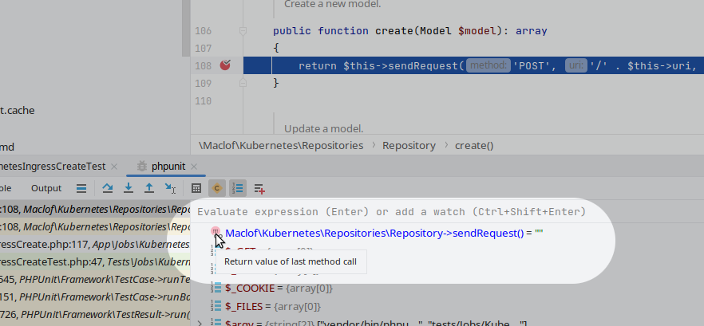

When working with a PHP codebase I really like to use [XDebug](https://xdebug.org/) as a way to find my way around and getting a grasp on what's going on.

One thing that annoyed me a bit was that in order to inspect return values of methods, I had to assign them to a dedicated variable.
This doesn't sound like a problem, but there can be a bunch of reasons why you don't want to change the code for this. For example, you could trace down some behavior in a vendor package, which really shouldn't be touched manually.

Luckily, this is a feature that [is implemented](https://twitter.com/derickr/status/1521889260202307586) with [XDebug v3.2](https://bugs.xdebug.org/bug_view_page.php?bug_id=00002087)! 

> Note: you can even try it out right now if you use [xdebug-3.2.0RC2](https://github.com/xdebug/xdebug/releases/tag/3.2.0RC2) and [PhpStorm 2022.3 Beta](https://blog.jetbrains.com/phpstorm/2022/11/phpstorm-2022-3-early-access-5/#Return_value_debugging_with_Xdebug)

If the return value is a result of a method call and you just want to take a quick look at it, you can just hit `Step Into` and `Step Out` immediately again, et voila!

