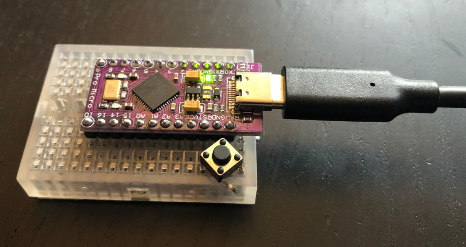
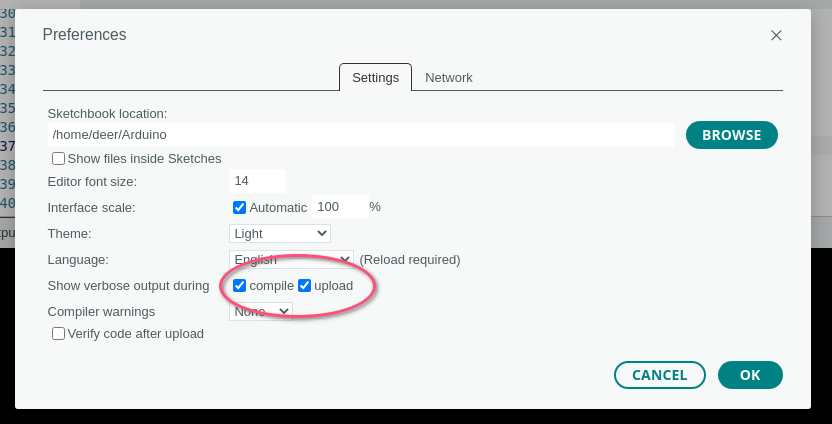

Recently I've been getting back a bit dabbling around with electronics. Currently I specifically like to use the [Sparkfun ProMicro](https://www.sparkfun.com/products/12640), because of it's on-board USB capabilities (more on that in a future blog post).

(yeah, it's a cheap clone I got from [aliexpress](https://archive.is/I7Rhd))

While setting up my Arduino IDE and playing around with it, I noticed that there are several ways that you can end up in a situation that makes it difficult to flash a new sketch to the board. In such states, your OS may report that a USB device wasn't recognized and the serial port may not show up in the Arduino IDE, which lets the board turn into a tiny [brick](https://en.wikipedia.org/wiki/Brick_(electronics)).

Luckily there is an official guide for resolving that issue on [learn.sparkfun.com](https://learn.sparkfun.com/tutorials/pro-micro--fio-v3-hookup-guide#ts-revive):

> First, you'll need to set the serial port to the bootloader. **But that port is only visible when the board is in bootloader mode**, so pull the reset line low twice quickly to invoke the bootloader reset feature discussed above. On Pro Micro's, or other devices which don't have a reset button, you can either use a wire to quickly short 'RST' to 'GND' twice, or wire up a temporary reset button. While the Pro Micro is in the bootloader change the 'Tools > Serial Port' menu to the bootloader COM port. **Quick! You've only got eight seconds.**

Maybe I'm getting old, but I just can't get it done in time. Not only do I have to re-select the port but also the board itself from a search dialog. It's mind-boggling to me why the Arduino IDE doesn't let you specify those settings beforehand. You could argue that I'm not only using an unofficial Arduino dev board but also a cheap clone of it, and you're totally right! But I experienced similar issues before, even with an official [Arduino Micro](https://store.arduino.cc/products/arduino-micro). Also, the IDE *always* recompiles the sketch before flashing it. The farthest I got was getting it to begin the flashing process, only to reach the eight second window right in the middle of it, which of course aborts the whole thing.

I enabled more verbose output of the flashing step to maybe find a more useful error message, and indeed I got lucky: I spotted the exact command that is run to flash the compiled sketch. By just running that myself in a terminal, I was able to flash the board instantly after I put it into the bootloader mode by just hitting the enter key of my keyboard instead of competing in a speedrun point'n'click challenge against the clock.

I published a repository containing a small script, with the needed `avrdude` configuration and an compiled empty sketch, in case someone needs this as well (I'm sure I will!): https://github.com/ledeniz/unbrick-promicro

Also, now I'm thinking about switching over again to using [PlatformIO](https://platformio.org/) instead of the Arduino IDE. But apart from the weird behavior this blog post is about, for now it still works okay enough for me and I still have some bad memories from using PlatformIO in the past.

P.S. While writing this blog post I listened to [this rendition](https://github.com/blakelivingston/DuinoTune/blob/master/test_songs/twinpeaks.xrns) of the Twin Peaks theme played on that very board visible above in the photo. I don't know the show, but the tune is pretty relaxing. And it sure is satisfying to let the little board put out some chiptune magic :>
