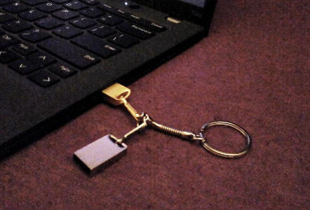

I use a laptop that I dual boot with Ubuntu and Windows[1]. It takes a surprisingly long time from power button press to GRUB menu, so I often press it and do immediately other things (thanks ADHD). It is only a slight inconvenience but recently one morning I literally woke up and thought to myself: wouldn't it be neat to have some kind of hardware switch to select which OS I want to boot? At first I thought about using one of those microcontroller devboards that you can directly plug into a USB port and adding some kind of toggle switch to it. But then I went an even simpler route: using two different USB drives and booting one or the other OS depending on which drive is plugged in.


> sorry Windows, you only get silver.

GRUB supports extensive [menu customization](https://help.ubuntu.com/community/Grub2/CustomMenus) via scripts, and that is what I did. I formatted both drives to FAT32 and gave each filesystem a label, which gets used to identify which drive is plugged in. Below is the finished script - if one of the drives is found then we skip the menu by setting the time we have to select an entry to 0 and setting the corresponding menu entry as the default one. If no drive with the right label is found we get dropped into the menu as usual and have 10 seconds to decide what to do. It would be kind of fun to not display the menu altogether, essentially letting the drives act as some sort of keys to the machine. But since it would not increase security and would be more like a party trick that probably no one will ever see, I rather have the option to boot without a magical USB drive.

[1] which is it's own little adventure if you want to use LUKS: https://askubuntu.com/a/293029

`/etc/grub.d/40_custom`
```sh
#!/bin/sh
exec tail -n +3 $0
# This file provides an easy way to add custom menu entries.  Simply type the
# menu entries you want to add after this comment.  Be careful not to change
# the 'exec tail' line above.

insmod search_label

search --no-floppy --label "LINUX"   --set usb_device_gold
search --no-floppy --label "WINDOWS" --set usb_device_silver

set timeout=0
if [ -n "$usb_device_gold" ]; then
        set default=0 # ubuntu
elif [ -n "$usb_device_silver" ]; then
        set default=2 # windows
else
    set timeout=10
    set default=saved
fi

# Save the configuration and update GRUB
save_env default
```
