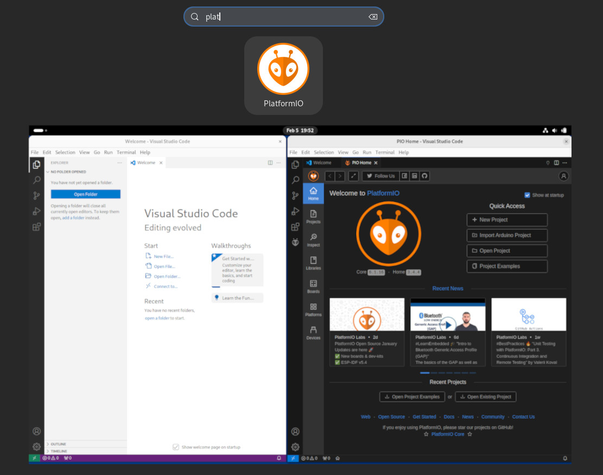

One thing I don't like about PlatformIO: it's quite bloaty. 

And that's alright because this is a tradeoff for the conveniences you get, but I really only want the extension running when I work on some code that I want to build/flash/debug etc.

Today I found a nice solution to this problem: you can start a completely separated Visual Studio Code instance, that you can dedicate to PlatformIO (or any other set of extensions/themes/settings/etc, really).
```
$ code --help
...
  --user-data-dir <dir>             Specifies the directory that user
                                    data is kept in. Can be used to
                                    open multiple distinct instances
                                    of Code.
...
 --extensions-dir <dir>             Set the root path for extensions.
```



So I created some nice desktop integrated shortcuts to make this convenient to launch. It seems vscode goes ahead and creates the directories you specify, I just use `user-data` and `ext-data` in a directory called `platformio-vscode` in my home directory. Obviously you have to adjust the filesystem paths in case you copy some of my config down below.

## Linux

I installed vscode via snap so I basically copied `/var/lib/snapd/desktop/applications/code_code.desktop`, changed it a little bit and put it into `~/.local/share/applications/`. I also like to add icons for these, so I downloaded the PlatformIO logo as a png file into `~/.icons/`.

> ([link to PlatformIO png logo](icon.png))

> note: the `.desktop` files need to be set executable - `chmod +x` will do the trick

You could slim down this file much more but this works for me:

```
[Desktop Entry]
X-SnapInstanceName=code-platformio
Name=PlatformIO
Comment=PlatformIO with VSCode
GenericName=Text Editor
Exec=env BAMF_DESKTOP_FILE_HINT=/home/dena/.local/share/applications/platformio.desktop /snap/bin/code --force-user-env --user-data-dir /home/dena/platformio-vscode/user-data --extensions-dir /home/dena/platformio-vscode/ext-data %F
Icon=platformio.png
Type=Application
StartupNotify=false
StartupWMClass=PlatformIO
Categories=TextEditor;Development;IDE;
MimeType=application/x-code-workspace;
Keywords=vscode;platformio;
```

## Windows
- search for "vscode" in start menu, right-click the link and choose "Open file location"
- copy the `Visual Studio Code.lnk` shortcut file
- right-click the copy, open `Properties` and add the command line options in the `Target` section:

```
"C:\Users\dena\AppData\Local\Programs\Microsoft VS Code\Code.exe" --user-data-dir C:\Users\dena\platformio-vscode\user-data --extensions-dir C:\Users\dena\platformio-vscode\ext-data
```

> ([link to PlatformIO .ico logo](platformio.ico))
